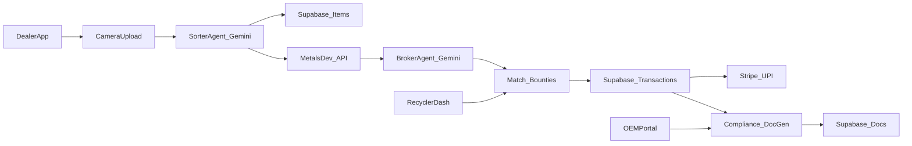

## UrbanMineAI MVP – Implementation & Design Plan

### 1. Scope and Alignment

- **Product scope**: Implement the full MVP described in [docs/project-context/Developer_Context/PRD.md](docs/project-context/Developer_Context/PRD.md) and [docs/project-context/Developer_Context/materplan.md](docs/project-context/Developer_Context/materplan.md), focusing on:
  - Dealer → AI grading → dynamic pricing → negotiation → matching/bounties → payment → compliance docs → dashboards.
  - Initial pilot geography: Ernakulam district, Kerala.
- **Design scope**: Treat [docs/project-context/design.json](docs/project-context/design.json) and screen prototypes in `docs/project-context/stitch_ui/` as the **single source of truth** for visual and interaction design.
- **Out of scope (MVP)**: Full logistics/routing, blockchain/DAO, advanced inventory SaaS, heavy analytics beyond basic dashboards.

### 2. High-Level Architecture

- **Architecture style**: Serverless PWA with unified frontend/backend in Next.js App Router.
- **Core stack (per PRD/masterplan)**:
  - **Framework**: Next.js 16 with React 19 and TypeScript.
  - **Hosting**: Vercel (Hobby).
  - **Database/Auth/Storage**: Supabase (PostgreSQL + pgvector, RLS, file storage for images/PDFs).
  - **AI**: Google Gemini (multimodal + text) via Vercel AI SDK 6.0; Generative UI for chat flows.
  - **Pricing**: Metals.Dev API.
  - **Payments**: Stripe with UPI-enabled checkout.
  - **PDFs**: `pdf-lib` for Form-6/EPR docs.
  - **UI library**: shadcn/ui + custom theme wired to `design.json` tokens.

A simplified architecture diagram:

### 3. Routing and Screen Map (from Stitch Designs)

Map Stitch UI screens in `docs/project-context/stitch_ui/` to Next.js app routes and layouts.

- **Auth and entry**
  - `login_and_role_selection/`
    - Route: `app/(auth)/login/page.tsx`.
    - Behavior: Email-based Supabase login; post-login role selection (Dealer, Recycler, OEM) when role not yet bound; vernacular toggle.
- **Dealer flows**
  - `mobile_dealer_dashboard/`, `dealer_inventory_dashboard/`:
    - Routes: `app/(dealer)/dealer/dashboard/page.tsx`, `app/(dealer)/dealer/inventory/page.tsx`.
    - Content: Inventory cards, recent deals, CTA buttons for "Scan New Item" and "View Bounties"; bottom nav for mobile.
  - `ai_waste_grading_agent/`:
    - Route: `app/(dealer)/dealer/scan/page.tsx`.
    - Behavior: Camera/photo upload, send to Gemini, show graded result as a "Grade Card" (material category, REE estimate, suggested price band), glassmorphism overlay.
  - `ai_broker_negotiation_chat/`:
    - Route: `app/(dealer)/dealer/deal-chat/[transactionId]/page.tsx`.
    - Behavior: WhatsApp-style chat UI with Generative UI components (deal cards, buttons for counter/accept), streaming responses from Gemini.
  - `e-waste_bounties_&_matches/`:
    - Route: `app/(dealer)/dealer/bounties/page.tsx`.
    - Behavior: List recyclers’ bounties; highlight matches for dealer’s inventory; status chips using status badge tokens.
  - `payments_and_settlements/`:
    - Route: `app/(dealer)/dealer/payments/page.tsx`.
    - Behavior: Stripe-hosted checkout/session history, KYC hints, payout summaries.
  - `profile_and_app_settings/`:
    - Route: `app/(dealer)/dealer/settings/page.tsx`.
    - Behavior: Profile, language, notification toggles.
- **Recycler flows**
  - `recycler_procurement_center/`:
    - Route: `app/(recycler)/recycler/procurement/page.tsx`.
    - Behavior: Bounties management, incoming offers, analytics snippets.
  - Shared `e-waste_bounties_&_matches/` design for recycler-side view of open/filled bounties.
- **OEM & compliance**
  - `oem_epr_compliance_portal/` and `compliance_&_document_vault/`:
    - Routes: `app/(oem)/oem/compliance/page.tsx`, `app/(oem)/oem/docs/page.tsx`.
    - Behavior: View/download Form-6 PDFs, EPR credit balances, filters by period and counterparty.

### 4. Design System Integration (Stitch → Code)

- **Token ingestion**
  - Parse [docs/project-context/design.json](docs/project-context/design.json) into a TypeScript config module exposing:
    - Color palette (primary, background, surface, semantic, gradients).
    - Typography scale (headings, body, caption).
    - Spacing grid, radii, shadows, glass effects.
  - Map tokens to:
    - Tailwind theme extension (if using Tailwind) or
    - CSS variables in a global stylesheet (`:root` for dark theme, optional light variant).
- **Component abstractions**
  - Create design-system primitives wrapping shadcn/ui using `component_specs`:
    - `Button` variants: `primary`, `secondary`, `icon` using primary green and glow effects.
    - `Input` and `InputWithIcon` following `inputs.default` and `inputs.with_icon` specs.
    - `Card` and `GlassCard` that apply glassmorphism from `effects.glass_panel`.
    - `StatusBadge` component with `success | warning | error | primary` variants.
    - `AppShell` components: `DesktopSidebar`, `MobileBottomBar`, `AppHeader` using navigation specs.
  - Enforce **no new colors or fonts** outside tokens; new components must be composed from these primitives (per `instructions_for_ai` in `design.json`).
- **Layout patterns**
  - Use 12-column grid and spacing scale for all screen layouts.
  - Apply bottom navigation for dealer mobile, desktop sidebar for recycler/OEM dashboards.
  - Maintain eco-futuristic "deep green + neon" aesthetic with glass overlays for modals, AI result overlays, and chat surfaces.

### 5. Core Feature Implementation Plan

#### 5.1 Authentication and Role Management

- Implement Supabase email/password auth and session management in Next.js (server components + middleware for protected routes).
- Data model: `Users` table with fields: `id`, `email`, `role`, `location`, `tier`, `created_at`.
- Post-login flow:
  - If `role` is null, redirect to role-selection view (using `login_and_role_selection` design).
  - Based on `role`, redirect to `/dealer/dashboard`, `/recycler/procurement`, or `/oem/compliance`.

#### 5.2 AI Sorter Agent (Waste Grading)

- Frontend:
  - Camera/file upload UI from `ai_waste_grading_agent` screen.
  - Show loading/skeleton state using glass cards.
- Backend (Server Action or API route):
  - Accept image, store in Supabase storage, then call Gemini vision model with structured prompt to return JSON (`category`, `subType`, `estimatedValue`, `reeEstimate`, `confidence`), enforcing schema via Zod.
  - Store item record in `Items` table with embedding from Gemini or separate embeddings model into `pgvector` column.
- Similarity search:
  - On each new grading, fetch nearest neighbors from `Items` by vector distance for price calibration and show "similar past deals" in UI.

#### 5.3 Dynamic Pricing Engine

- Implement `pricingService` module:
  - Fetch live base prices from Metals.Dev for key materials (copper, gold, neodymium etc.).
  - Apply REE premium factors based on AI metadata (e.g., magnet weight) and local margins.
  - Provide rate card endpoint and internal utility used by Sorter and Broker agents.
- UI:
  - "Live Rate Card" panel in dealer dashboard and bounties screen using card + status badges.

#### 5.4 Broker Agent (Negotiation Chat with Generative UI)

- Chat UI:
  - Use `ai_broker_negotiation_chat` Stitch design for layout (messages, deal summary card, quick-reply chips).
  - Integrate Vercel AI SDK streaming for Gemini chat completion.
- Agent behavior:
  - Input: Target item, dealer constraints (min acceptable price), live rates, buyer preferences.
  - Output: Proposed price, counter-offers, summary states ("Offer pending", "Countered"), plus **UI actions** (e.g., `[{ type: 'button', label: 'Accept ₹X', action: 'accept' }]`) that map to rendered React components.
- State management:
  - Persist chat history and decision points to `Transactions` and an auxiliary `NegotiationMessages` table for auditability.

#### 5.5 Matching, Bounties, and Market Flows

- Bounties model:
  - `Bounties` table: `id`, `recycler_id`, `material`, `min_grade`, `quantity_kg`, `price_floor`, `status`, `expires_at`.
  - Matching service that ranks dealer items vs open bounties on material/grade/location.
- Dealer-side UI:
  - "Matches for you" section with badges, using `e-waste_bounties_&_matches` cards.
- Recycler-side UI:
  - Bounty creation and management in `recycler_procurement_center` screen structure.

#### 5.6 Payments and Settlements

- Integrate Stripe in test mode initially:
  - Server Action to create Checkout or Payment Link sessions with UrbanMineAI commission logic (10% subtraction) embedded.
  - Webhook handler (edge function) to update `Transactions` and `Payments` tables upon payment success.
- UI:
  - `payments_and_settlements` screen shows recent payouts, statuses, and links to underlying transactions; style with status badges.

#### 5.7 Compliance and EPR Docs

- Data model:
  - `Transactions` table extended with `pickup_date`, `material_breakdown`, `weight_kg`, `counterparty_ids`.
  - `Docs` table: `id`, `transaction_id`, `pdf_url`, `hash`, `doc_type`.
- PDF generation:
  - Backend function using `pdf-lib` to generate Form-6/EPR PDFs from transaction data.
  - Compute hash (e.g., SHA-256) of raw PDF bytes; store hash in DB.
- UI:
  - `compliance_&_document_vault` design for OEM and recycler views: filter toolbar, list of documents, detail preview/download buttons.

#### 5.8 Dashboards and Analytics

- Dealer dashboard (per `dealer_inventory_dashboard` and `mobile_dealer_dashboard`):
  - Cards for current balance, recent deals, quick CTAs.
  - List of current inventory with status badges.
- Recycler dashboard:
  - Procurement funnel views, top suppliers, open bounties, simple charts.
- OEM portal:
  - Aggregated EPR credits, compliance coverage, downloads of docs.

### 6. Data Model and Supabase Schema (Conceptual)

- **Users**: `id (uuid)`, `email`, `role` (`dealer|recycler|oem`), `location`, `tier`, `created_at`.
- **Items**: `id`, `user_id`, `image_url`, `metadata` (JSON from AI), `embedding` (vector), `status`, `created_at`.
- **Transactions**: `id`, `supplier_id`, `buyer_id`, `item_ids` (array), `price_total`, `status`, `payment_ref`, `pickup_date`, `material_breakdown` (JSON), `created_at`.
- **Bounties**: `id`, `recycler_id`, `material`, `min_grade`, `quantity_kg`, `price_floor`, `status`, `expires_at`.
- **Docs**: `id`, `transaction_id`, `pdf_url`, `hash`, `doc_type`, `created_at`.
- **NegotiationMessages** (optional): `id`, `transaction_id`, `sender` (`dealer|agent|recycler`), `message`, `payload` (JSON for buttons/cards), `created_at`.
- Apply Supabase RLS for per-role access as described in the PRD and masterplan.

### 7. Security, Performance, and NFRs

- **Security**:
  - Supabase Auth + RLS-based RBAC; strict per-role route protection in Next.js.
  - Encrypt sensitive fields (e.g., payment references) at rest.
  - Sanitize all AI inputs/outputs; enforce schema validation.
- **Performance**:
  - Target <2s AI grading response by optimizing image size and batching.
  - Cache Metals.Dev pricing locally with short TTL (e.g., 5–10 minutes).
- **Reliability**:
  - Leverage Vercel’s serverless scaling; monitor Supabase quotas.
- **Accessibility & Vernacular**:
  - Implement language toggle and localization framework (e.g., `next-intl`), with Malayalam/English copy aligned to persona expectations.

### 8. Phase Plan (8-Week MVP)

- **Phase 1 (Weeks 1–2): Foundation**
  - Initialize Next.js 16 project with App Router, TypeScript, shadcn/ui, and design-system integration from `design.json`.
  - Set up Supabase project, core tables, and auth; build login + role selection flow.
  - Implement base app shells for Dealer, Recycler, OEM using Stitch navigation patterns.
- **Phase 2 (Weeks 3–4): AI and Core Flows**
  - Implement AI Sorter Agent (image upload → Gemini → Supabase `Items`).
  - Implement Dealer dashboard and scan result UI.
  - Implement Broker Agent chat with Generative UI for at least a basic negotiation loop.
- **Phase 3 (Weeks 5–6): Integrations and Compliance**
  - Integrate Metals.Dev pricing and build dynamic rate card.
  - Integrate Stripe for payments and link to Transactions.
  - Implement Form-6/EPR PDF generation and compliance document vault UIs.
- **Phase 4 (Weeks 7–8): Polish, Testing, and Pilot Readiness**
  - Usability tests with target users (kabadiwalas, compliance personas) focusing on Stitch-aligned UI.
  - Performance tuning, error handling, vernacular content refinement.
  - Prepare demo flows for UCEST206 and KSUM grant pitch, recording key journeys.
- **Post-MVP**
  - Expand analytics, inventory SaaS features, logistics helpers, and potential blockchain traceability, following the directions in `materplan.md`.

